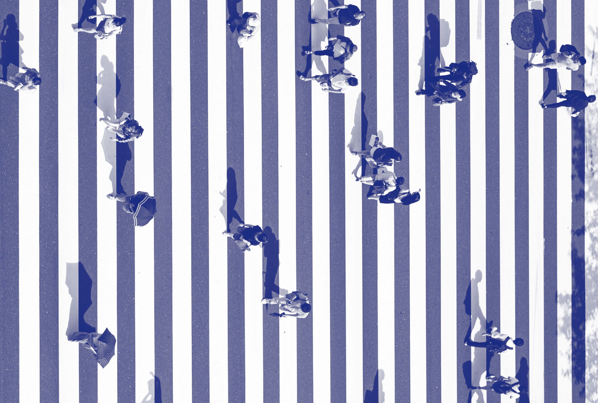

```{r database, message=TRUE, warning=TRUE, include=FALSE, paged.print=TRUE}


```


```{r xaringanExtra1, include=FALSE}
xaringanExtra::use_xaringan_extra(c("tile_view", "share_again", "scribble"))
```

class: middle hide-logo title

```{r xaringanExtra2, echo = FALSE}
xaringanExtra::use_progress_bar(color = "red", location = c("top"))
```
.pull-left-narrow[
.espaciosimple[
.tiny[]
]


<br><br><br><br><br>
]

.pull-right-wide[
.right[

.content-box-red[
.center[

## Introducción a la manipulación y análisis descriptivo de datos en R

.medium[


]
]
]

.medium[.red[#### Aprendiendo Metodología por Valentina]]


----
.espaciosimplelineas[

.medium[.bold[Andreas Laffert]] .tiny[.blue[(_andreas.laffert@ug.uchile.cl_)]]

.medium[.bold[Daniela Olivares]] .tiny[.blue[(_danielaolivarescollio@gmail.com_)]]


]


.small[
Junio 2023, Santiago.

  ]

]
]

</br>
.left.tiny[Taller N° 7: Talleres 2023 Aprendiendo Metodología por Valentina]

---
class: inverse middle center, slideInRight

.medium[ 
### Estructura de presentación
]


.medium[ 
1. 
2. 
3. 
4. 
5. 
]


---
class: inverse middle center, slideInRight
background-size: 12%
background-position: 99% 1%

## 1. 

---
